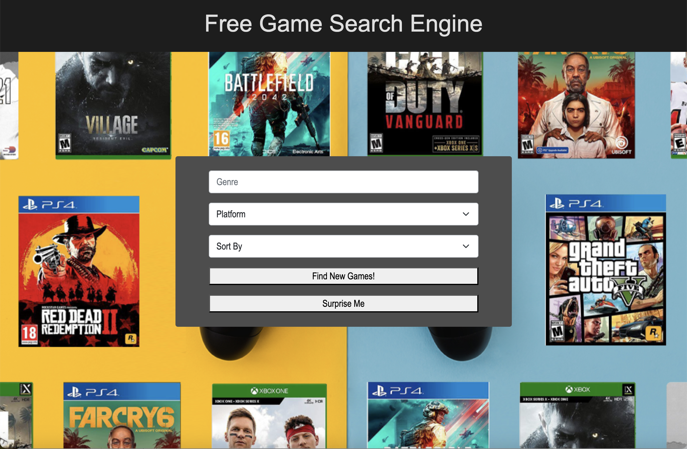
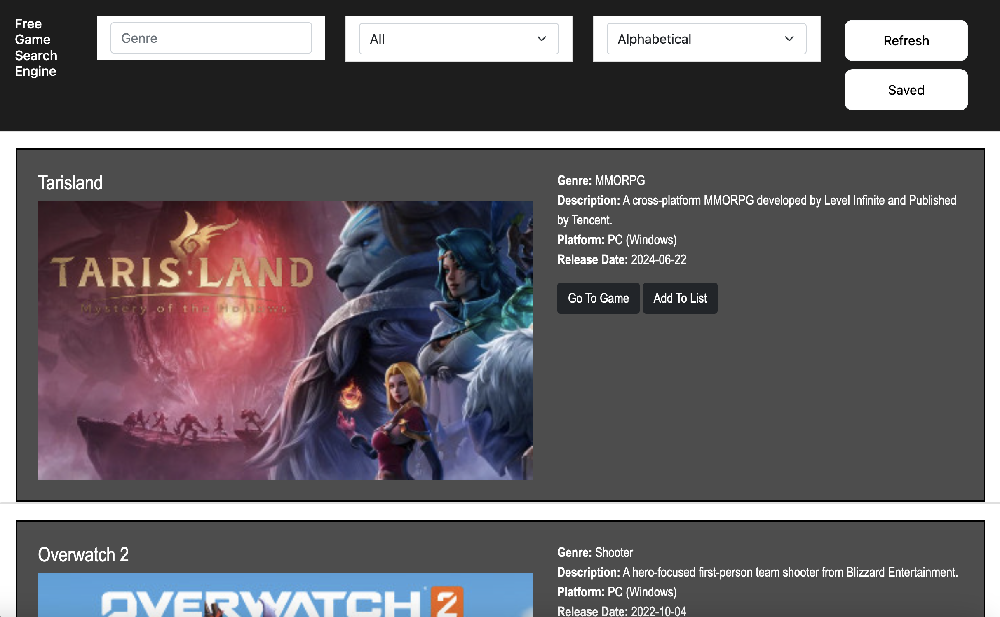

# Group Project #01 - FREE GAME SEARCH ENGINE


## PROJECT DESCRIPTION
- Utilizing the "Free to Game" API, our FREE GAME SEARCH ENGINE is a browser-based search engine used to link players with all available free games on the Internet.


### User Interface

INDEX PAGE:

- Filtered by GENRE, PLATFORM & SORT-BY (release date, relevance, popularity, alphabetical) - the user will enter their preferred genre --> toggle their preferred platform in the dropdown menu --> toggle how the page will be sorted in the dropdown menu --> click FIND NEW GAMES! --> their search parameters will be brought up on the next page.

OR

- Click "SURPRISE ME!" --> user will be brought to the site of a random game (regardless of any search parameters).


SEARCH PAGE:

- The user will be brought to the search page with a list of game cards that, using our new technology: "SCROLLREVEAL.JS", will animate the reveal of new cards as the user moves down the page.

- At the top, the user will be able to refine their search with the parameters in the previous page - after clicking the "REFRESH" button.

- Within each card, the user will be able to go to the developer's website by clicking "GO TO GAME"

OR

- Click "ADD TO LIST" to save this entry to local storage and access the saved list by clicking "SAVED" at the top. Inside the modal, they'll have the option to click on the game's thumbnail to visit the site OR remove the game from the list.

- A broswer alert will notify the user the selected game has been succesfully added to local storage "SAVED"


### Under the Hood
- Our site uses Bootstrap to allow for responsive web design & modal functionality with our buttons, form elements & local storage shopping cart.

- Used jQuery autocomplete function in the "GENRE" input to show all available genres inside the API.

- Used template literals in "SEARCH.JS" to responsively build the game card elements inside the search page, based on the user's search parameters.


### File Structure

```md
project01
├── assets
│ ├── css
│ │ ├── reset.css
│ │ ├── search.css
│ │ └── styles.css
│ └── js
│ | ├── index.js
│ | ├── search.js
│ | └── shared.js
├── index.html
├── search-index.html
└── README.md
```


## TEAM MEMBERS

- Tanner Johnson
- Noah Raffensparger
- Kou Yang
- Nash Peterson


## LINK TO DEPLOYED SITE
[Click here to see the deployed version](https://kou32.github.io/group-project1/)


## SCREENSHOTS OF SITE


